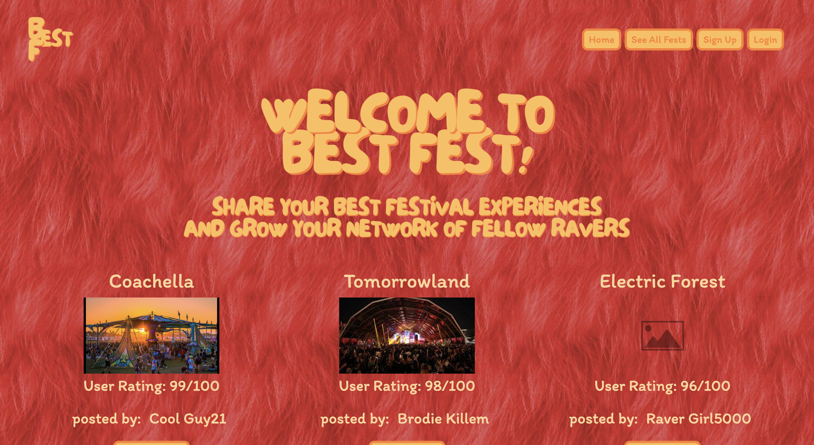

# Best Fest

Best Fest is a web application that allows users to review and rate music festivals, as well as share their favorite sets and interact with other users through comments.

## Table of Contents

1. [Installation and Setup](#installation-and-setup)
2. [Folder Structure](#folder-structure)
3. [Models](#models)
4. [Middleware](#middleware)
5. [Configuration](#configuration)
6. [License](#license)

## Installation and Setup

To install and run the project on your local machine, follow these steps:

1. Clone this repository to your local machine.
2. Run `npm install` to install all required dependencies.
3. Create a `.env` file in the root folder and set the necessary environment variables:

PORT=<your_port>
MONGODB_URI=<your_mongodb_uri>
SESSION_SECRET=<your_session_secret>
CLOUD_NAME=<your_cloudinary_cloud_name>
API_KEY=<your_cloudinary_api_key>
API_SECRET=<your_cloudinary_api_secret>

4. Run `npm start` to start the application.

## Folder Structure

The application is organized into the following folders:

- `config`: Contains configuration files for the application, including Cloudinary settings.
- `middleware`: Contains custom middleware functions for route protection and user authorization.
- `models`: Contains the Mongoose schema definitions for the User, Fest, and Comment models.
- `public`: Contains static files, including images, stylesheets, and client-side JavaScript.
- `routes`: Contains the route definitions for the application.
- `views`: Contains the Handlebars templates used for rendering the pages.

## Models

The application uses three models: User, Fest, and Comment.

### User

- Contains fields for the username, email, password, profileImageUrl, and bio.

### Fest

- Contains fields for the festival name, review, rating, imageUrl, favSet, owner, and comments.

### Comment

- Contains fields for the user, comment, and festId.

## Middleware

The application uses custom middleware to handle route protection and user authorization. These functions are stored in the `route-guard.js` file.

#### isLoggedIn

- Checks if the user is logged in. If not, renders the login page with an error message.

#### isLoggedOut

- Checks if the user is logged out. If the user is logged in, redirects to the user's profile page.

#### isOwner

- Verifies if the user is the owner of the festival. If not, redirects to the festival details page.

#### isCommentOwner

- Verifies if the user is the owner of the comment. If not, redirects to the festival details page of the associated festival.

## Configuration

The application uses Cloudinary for image hosting and manipulation. The Cloudinary configuration can be found in the `cloudinary.config.js` file in the `config` folder.

## License

This project is licensed under the Creative Commons Attribution-NonCommercial-ShareAlike 4.0 International License - see the [LICENSE](LICENSE) file for details.

## Support

If you have any questions or encounter any issues while playing the game, please open an issue on the GitHub repository.
